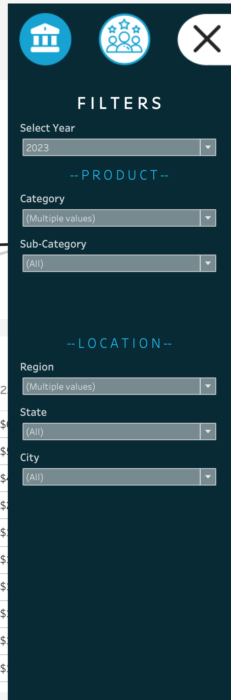

# Sales-Dashboard (Tableau)
# 📊 Retail Insights 2023 — Tableau Dashboard  

An interactive Tableau project designed to visualise retail sales and customer behaviour in 2023, offering data-driven insights into revenue, profitability, and engagement.  

---

## 🧩 Project Overview  
The **Retail Insights Dashboard** provides a comprehensive view of sales and customer data to help businesses monitor performance, analyse profitability, and identify opportunities for growth.  

Built using Tableau Desktop, this project features two integrated dashboards — **Sales Dashboard** and **Customer Dashboard** — along with an **interactive filter panel** for flexible exploration by category, sub-category, region, and more.  

---

## ⚙️ Tech Stack  
This project was developed using the following tools and technologies:  

- 🟣 **Tableau Desktop** – Primary data visualisation platform  
- 🧹 **Excel / Tableau Prep** – For data cleaning and preparation  
- 🧮 **Calculated Fields** – Used to compute YOY growth, ranking, and profit margins  
- 🔗 **Data Modelling** – Relationships among sales, product, and customer tables  
- 📁 **File Format** – `.twb` (Tableau Workbook) for the main project and `.png` for dashboard previews  

---

## 🗂️ Data Source  
The dataset contains **retail transactions** from 2023, covering:  
- Sales, profit, and quantity across various product categories  
- Customer profiles with purchase history and order frequency  
- Regional and city-level segmentation for location-based insights  

---

## ✨ Dashboard Highlights  

### 🧾 Sales Dashboard  
- **Total Sales, Profit, and Quantity KPIs** with YOY growth comparison  
- **Sales & Profit by Sub-Category** – Compare performance between 2023 and 2022  
- **Sales & Profit Trends Over Time** – Visualises weekly trends using colour-coded signals (blue = above average, orange = below average)  

### 👥 Customer Dashboard  
- **Total Customers, Orders, and Sales per Customer** to track engagement metrics  
- **Customer Distribution by Number of Orders** – Histogram showing order frequency patterns  
- **Top 10 Customers by Profit** – Ranked table showing profit, sales, and recent activity  

### 🎛️ Interactive Filter Panel  
Filter dashboards dynamically by:  
- Year  
- Product Category & Sub-Category  
- Region, State, and City  

---

## 💡 Business Context & Insights  

### **Business Problem**  
Retail teams often struggle to monitor performance across multiple channels, products, and customer segments in real time.  

### **Goal of the Dashboard**  
To build a unified Tableau interface that delivers actionable insights into:  
- Sales growth and profit margins  
- Customer retention and order behaviour  
- Regional performance and product category efficiency  

### **Key Insights Derived**  
- 📈 Profitability increased by 12.5% YoY, driven by high-margin product categories.  
- 👥 Loyal customers (3+ orders) contribute the majority of profits.  
- 🌍 Certain regions outperform others in both order volume and profit conversion.  
- 🎯 Identified top 10 customers who together account for a major share of annual profit.  

---

## 🖼️ Dashboard Previews  

### 🧾 Sales Dashboard  
  

### 👥 Customer Dashboard  
  

### 🎛️ Filter Panel  
  

---

## 🚀 How to Use  
1. Download the file **`Sales Dashboard.twb`**.  
2. Open it in **Tableau Desktop** (2021.4 or later).  
3. Connect it to your data source (Excel/CSV).  
4. Use the interactive filters to explore insights by year, region, or category.  

---

## 👨‍💻 Author  
**Shubdeep Nayak**  
🎓 *PGDM – Business Analysis | Data & Business Analyst | Tableau Developer*  
📧 [your.email@example.com]  
🔗 [GitHub Profile](https://github.com/yourusername)  

---

⭐ *If you like this project, don’t forget to star the repository and check out more of my analytics dashboards!*  
